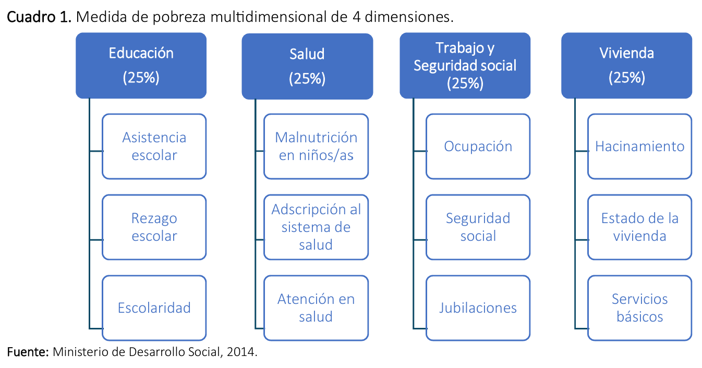
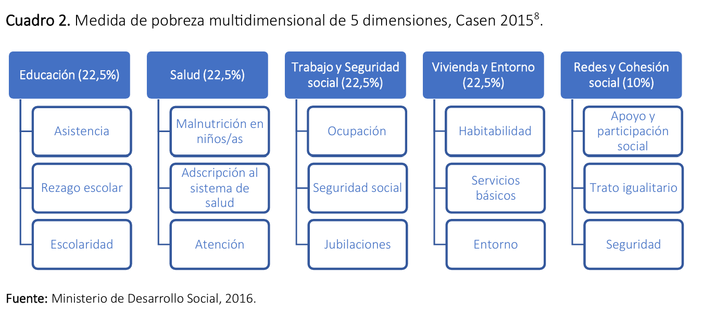
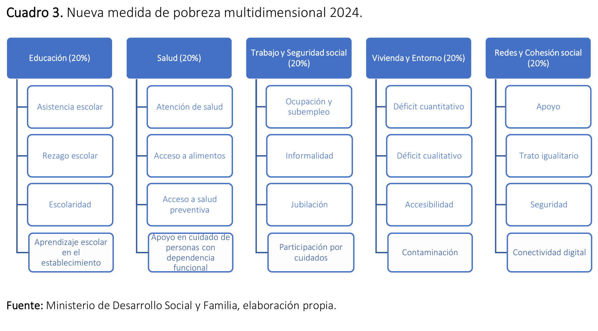

```{r}
#| label: setup
#| include: false
options(scipen = 999)
library(tidyverse)
library(haven)
library(sjmisc)
library(knitr)
```

## {.portada}

::: {.portada-top}


Prof. Pablo Pérez Ahumada<br>
Apoyo docente: Javiera Romo Sánchez<br>
Ayudantes: Valentina Montecinos, Martina Buzio, Javiera Álvarez, Millaray Vergara y Tomás González.
:::

::: {.portada-curso}
Estrategias de Investigación<br>Cuantitativa
:::

::: {.portada-taller}
Taller<br>práctico N°1
:::

::: {.portada-tema}
Dos formas de medir la pobreza · Índice de pobreza multidimensional con CASEN 2024 en R
:::

## {.seccion}

::: seccion-texto
Un poco de contexto
:::

## Pobreza multidimensional con cuatro dimensiones

::: subtitulo
Medida introducida con Casen 2013
:::



## Pobreza multidimensional con cinco dimensiones


::: subtitulo
Medida introducida con Casen 2015 (publicada en 2016)
:::



## {.centrado}

:::: {.columns}
::: {.column width="58%"}
{height="600"}
:::
::: {.column width="42%"}
{height="600"}
:::
::::

## Pobreza multidimensional con cinco dimensiones

::: subtitulo
Nueva medida 2024 (Casen 2024)
:::


## {.centrado}

<br><br><br>

::: grande
Hoy construiremos la primera versión del índice de pobreza multidimensional con cinco dimensiones.

<br>

Es decir, la de 2015 (publicada en 2016).
:::

## {.seccion}

::: seccion-texto
¿Cómo construir el índice de pobreza multidimensional con estas cinco dimensiones?
:::

## Antes de empezar: descarguen el proyecto desde UCursos

<br>

::: centrado
[⬇ Descargar practico_1_R.zip](practico_1_R.zip){.boton}
:::

<br>

1. Descarguen y **descompriman** la carpeta (clic derecho → *Extraer todo*).
2. Abran **`practico_1_R.Rproj`** con doble clic. Se abre RStudio con todo listo.
3. Abran **`script/practico_1.R`** y sigan el taller desde ahí.

::: nota
**Dentro de la carpeta:** `input/` (base de datos) · `docs/` (libro de códigos, cuestionario, metodología) · `script/` (código del práctico) · `output/` (donde guardaremos resultados)
:::

## Paso 1: buscar base de datos y documentación

Necesitamos:

- **Libro de códigos** 
- **Cuestionario** 
- **Informes metodológicos**
- Etc.

<br>

## Paso 2: identificar las variables que necesitamos

## Paso 2: identificar las variables que necesitamos

::: {.dims .c5}
::: dim
::: cab
Educación
:::
::: ind
`hh_d_asis_2015`
:::
::: ind
`hh_d_rez_2015`
:::
::: ind
`hh_d_esc_2015`
:::
:::
::: dim
::: cab
Salud
:::
::: ind
`hh_d_mal_2015`
:::
::: ind
`hh_d_prevs_2015`
:::
::: ind
`hh_d_acc_2015`
:::
:::
::: dim
::: cab
Trabajo y Seguridad social
:::
::: ind
`hh_d_act_2015`
:::
::: ind
`hh_d_cot_2015`
:::
::: ind
`hh_d_jub_2015`
:::
:::
::: dim
::: cab
Vivienda y Entorno
:::
::: ind
`hh_d_habitab_2015`
:::
::: ind
`hh_d_servbas_2015`
:::
::: ind
`hh_d_entorno_2015`
:::
:::
::: dim
::: cab
Redes y Cohesión social
:::
::: ind
`hh_d_appart_2015`
:::
::: ind
`hh_d_tsocial_2015`
:::
::: ind
`hh_d_seg_2015`
:::
:::
:::

## Paso 3: preparar el entorno de trabajo

::: chico
Abrir RStudio desde el proyecto `practico_1_R.Rproj`.
:::

```{r}
#| label: paso3
options(scipen = 999)   # desactiva la notación científica
rm(list = ls())         # limpia el entorno de trabajo (borra todos los objetos)

#install.packages("pacman")
library("pacman")
pacman::p_load(tidyverse,  # manipulación de datos y gráficos
               haven,      # variables etiquetadas
               sjmisc,     # frq(): tablas de frecuencias
               sjPlot)     # tab_xtab(): tablas cruzadas

casen <- readRDS("input/casen_2024_practico.rds") # Abrir base de datos

```

## Paso 4: revisamos nuestras variables

Vemos: **(1)** que tengan las categorías de respuesta correspondientes y **(2)** que sean numéricas.

:::: {.columns}
::: {.column width="55%"}
```{r}
#| label: paso4a
frq(casen$hh_d_asis_2015)
```
:::
::: {.column width="45%"}
```{r}
#| label: paso4b
class(casen$hh_d_asis_2015)
```

::: nota
`haven_labelled` = un número **con etiqueta**. Para calcular promedios nos conviene dejarlas como numéricas simples.
:::
:::
::::

## Paso 5: limpiamos y recodificamos {.codigo-chico}

::: chico
Asegurarnos que nuestra base de datos quede únicamente con las variables que usaremos. Y, que esas variables queden listas para usarse.
:::

```{r}
#| label: paso5
#| code-line-numbers: "|1-18|20-22"
datos <- casen %>%
  select(area,
         asistencia = hh_d_asis_2015, 
         rezago = hh_d_rez_2015, 
         escolaridad = hh_d_esc_2015,
         malnutricion = hh_d_mal_2015, 
         adscripcion = hh_d_prevs_2015, 
         atencion = hh_d_acc_2015,
         ocupacion = hh_d_act_2015, 
         seguridad_social = hh_d_cot_2015, 
         jubilaciones = hh_d_jub_2015,
         habitabilidad = hh_d_habitab_2015, 
         servicios_basicos = hh_d_servbas_2015, 
         entorno = hh_d_entorno_2015,
         apoyo_participacion = hh_d_appart_2015, 
         trato_igualitario = hh_d_tsocial_2015, 
         seguridad = hh_d_seg_2015)

datos <- datos %>%
  mutate(across(asistencia:seguridad, ~ as.numeric(zap_labels(.x))),
         area    = as_factor(area))
```

## {.seccion}

::: seccion-texto
Con lo anterior listo, comenzamos con el cálculo
:::

## Paso 6: se promedia cada dimensión

::: formula
Por ejemplo, para educación: $\dfrac{\text{asistencia}_{[0,1]} + \text{rezago}_{[0,1]} + \text{escolaridad}_{[0,1]}}{3}$
:::

```{r}
#| label: paso6
datos <- datos %>%
  mutate(
    d_educacion = rowMeans(across(c(asistencia, rezago, escolaridad))),
    d_salud     = rowMeans(across(c(malnutricion, adscripcion, atencion))),
    d_trabajo   = rowMeans(across(c(ocupacion, seguridad_social, jubilaciones))),
    d_vivienda  = rowMeans(across(c(habitabilidad, servicios_basicos, entorno))),
    d_redes     = rowMeans(across(c(apoyo_participacion, trato_igualitario, seguridad)))
  )

frq(round(datos$d_educacion, 2))
```

## Paso 7: se ponderan y suman las dimensiones

::: arbol
::: raiz
Pobreza multidimensional
:::
::: hojas
::: hoja
Educación<br>22,5%
:::
::: hoja
Salud<br>22,5%
:::
::: hoja
Trabajo<br>22,5%
:::
::: hoja
Vivienda y entorno<br>22,5%
:::
::: hoja
Redes y cohesión social<br>10%
:::
:::
:::

::: formula
$0{,}225 \cdot \text{Educ.}_{[0,1]} + 0{,}225 \cdot \text{Salud}_{[0,1]} + 0{,}225 \cdot \text{Trabajo}_{[0,1]} + 0{,}225 \cdot \text{Vivienda}_{[0,1]} + 0{,}10 \cdot \text{Redes}_{[0,1]}$
:::

```{r}
#| label: paso7
datos <- datos %>%
  mutate(indice_pm = 0.225 * d_educacion + 0.225 * d_salud + 0.225 * d_trabajo +
                     0.225 * d_vivienda  + 0.10  * d_redes,
         indice_pm = round(indice_pm, 4))   # evita errores de decimales (ej. 0.22499999)
```

## ¿Qué nos quedó?

Un **índice con valores del 0 al 1** que indican el grado de carencias (ponderadas) que tiene cada hogar.

```{r}
#| label: histograma
#| echo: false
#| fig-width: 11
#| fig-height: 4.2
#| fig-align: center
grafico_indice <- datos %>%
  filter(!is.na(indice_pm)) %>%
  ggplot(aes(indice_pm)) +
  geom_histogram(aes(y = after_stat(count / sum(count))),
                 binwidth = 0.075, boundary = 0, closed = "left",   # 0,075 = peso de un indicador
                 fill = "#4472c4", colour = "white") +
  scale_x_continuous(breaks = seq(0, 1, 0.1), limits = c(0, 0.8)) +
  scale_y_continuous(labels = scales::percent) +
  labs(x = "Índice de pobreza multidimensional ponderado (0 = sin carencias, 1 = todas)",
       y = "% de casos") +
  theme_minimal(base_size = 16) +
  theme(panel.grid.minor = element_blank())

grafico_indice
```

::: nota
**Ejemplo:** si un hogar tiene **0,30** en el índice, este hogar posee un 30% de carencias ponderadas (respecto al total del índice).
:::

## ¿Qué podemos hacer con esto?

**Simplificar aún más:** definir un **umbral** de pobreza y crear una variable **dummy** que nos diga si los hogares están en situación de pobreza considerando todos los indicadores.

```{=html}
<svg viewBox="0 0 1000 170" width="100%" style="margin-top:10px">
  <text x="130" y="30" text-anchor="middle" font-size="20" font-family="Mulish">0 = Hogares que no están</text>
  <text x="130" y="55" text-anchor="middle" font-size="20" font-family="Mulish">en situación de pobreza</text>
  <text x="610" y="55" text-anchor="middle" font-size="20" font-family="Mulish">1 = Hogares en situación de pobreza multidimensional</text>
  <line x1="40" y1="100" x2="960" y2="100" stroke="#444" stroke-width="5"/>
  <g stroke="#444" stroke-width="8">
    <line x1="40" y1="80" x2="40" y2="120"/><line x1="500" y1="80" x2="500" y2="120"/><line x1="960" y1="80" x2="960" y2="120"/>
  </g>
  <line x1="247" y1="75" x2="247" y2="125" stroke="#ef5350" stroke-width="6"/>
  <g font-size="22" font-family="Mulish" text-anchor="middle" fill="#333">
    <text x="40" y="150">0</text><text x="500" y="150">0.5</text><text x="960" y="150">1</text>
  </g>
  <text x="247" y="150" text-anchor="middle" font-size="22" font-family="Mulish" fill="#ef5350" font-weight="800">0.225 · Umbral</text>
</svg>
```

::: chico
En la medida oficial el umbral es **22,5%**: el equivalente a tener carencias en una dimensión tradicional completa.
:::

## ¿Dónde cae el umbral?

Los hogares a la **derecha** de la línea roja (22,5% o más de carencias ponderadas) quedan clasificados como **pobres multidimensionales**.

```{r}
#| label: histograma-umbral
#| echo: false
#| fig-width: 11
#| fig-height: 4.6
#| fig-align: center
grafico_indice +
  geom_vline(xintercept = 0.225, colour = "#ef5350", linewidth = 1.4) +
  annotate("text", x = 0.24, y = Inf, vjust = 1.5, hjust = 0,
           label = "Umbral 0,225", colour = "#ef5350", fontface = "bold", size = 6)
```

## Paso 8: aplicamos el umbral y creamos la dummy

```{r}
#| label: paso8
datos <- datos %>%
  mutate(pobreza_pm = case_when(indice_pm >= 0.225 ~ 1,
                                indice_pm <  0.225 ~ 0,
                                TRUE ~ NA_real_))

frq(datos$pobreza_pm)
```

## Resultados

```{r}
#| label: resultados
# % de casos en pobreza multidimensional
datos %>%
  summarise(pct_pobreza = mean(pobreza_pm, na.rm = TRUE) * 100)
```

## Resultados según área

```{r}
#| label: area
datos %>%
  group_by(area) %>%
  summarise(indice_promedio = mean(indice_pm, na.rm = TRUE),
            pct_pobreza     = mean(pobreza_pm, na.rm = TRUE) * 100)
```

```{r}
#| label: area-grafico
#| echo: false
#| fig-width: 11
#| fig-height: 3.2
#| fig-align: center
datos %>%
  group_by(area) %>%
  summarise(pct = mean(pobreza_pm, na.rm = TRUE)) %>%
  ggplot(aes(pct, fct_rev(area))) +
  geom_col(fill = "#4472c4", width = 0.6) +
  geom_text(aes(label = scales::percent(pct, accuracy = 0.1, decimal.mark = ",")), hjust = -0.15, size = 6) +
  scale_x_continuous(labels = scales::percent, expand = expansion(mult = c(0, 0.15))) +
  labs(x = "% de casos en pobreza multidimensional (umbral 0,225)", y = NULL) +
  theme_minimal(base_size = 18) +
  theme(panel.grid.major.y = element_blank(), panel.grid.minor = element_blank())
```
